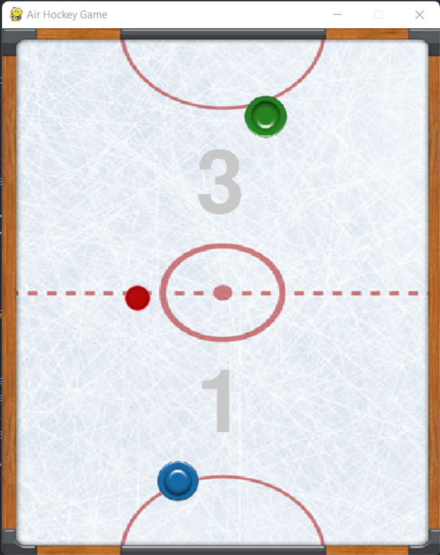

# Air hockey game
> Air hockey is a game where two players compete against each other on a low friction table. Air hockey requires an air hockey table, two forwards held by the players, and a puck.

# Screenshots

# Requirements
- [x] Python
- [x] Pygame
- [x] Pygame-menu
